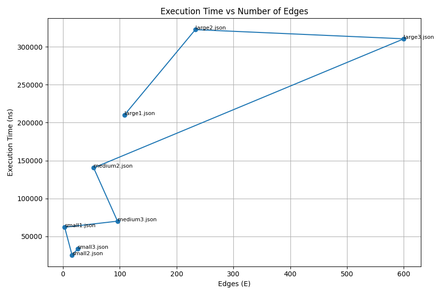
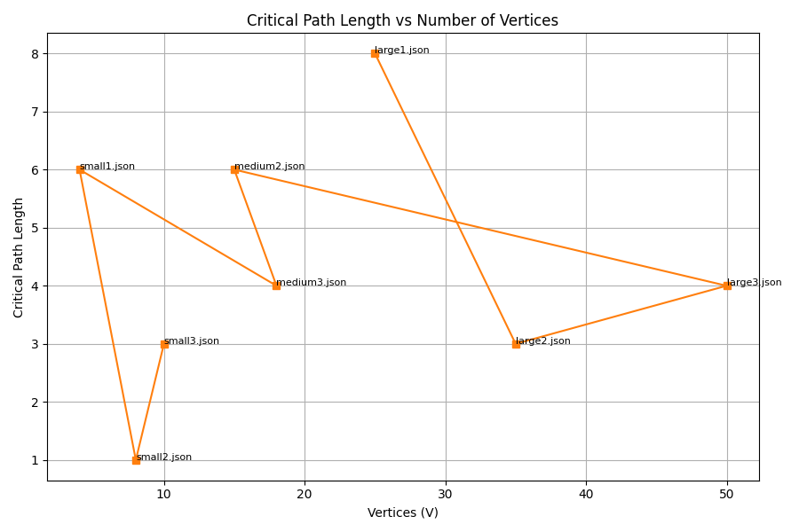

# Assignment 4 — Smart City / Smart Campus Scheduling

## 🎯 Objective
Integrate three core graph algorithms — **Strongly Connected Components (SCC)**,  
**Topological Sorting**, and **Shortest/Longest Paths in Directed Acyclic Graphs (DAGs)** —  
to model and optimize the scheduling of Smart City or Smart Campus tasks.

---

## 🧠 Algorithms Implemented

### 1️⃣ Strongly Connected Components (SCC)
- **Algorithm:** Tarjan (DFS-based)
- **Purpose:** Detects cycles and groups mutually dependent tasks into single components.
- **Output:** List of SCCs and a condensation DAG.
- **Complexity:** O(V + E)

### 2️⃣ Topological Sorting
- **Algorithm:** Kahn’s Algorithm (BFS-based)
- **Purpose:** Generates a valid execution order for DAGs (after SCC compression).
- **Complexity:** O(V + E)

### 3️⃣ Shortest & Longest Paths in DAG
- **Approach:** Dynamic programming over topological order.
- **Weight Model:** Edge-weighted.
- **Longest Path:** Represents the **critical path** (total project duration).
- **Complexity:** O(V + E)

---

## 📂 Dataset Overview

| File | V | E | Type | SCC | Description |
|------|--:|--:|------|----:|-------------|
| small1.json | 4 | 3 | DAG | 4 | Very small sample graph |
| small2.json | 8 | 16 | DAG | 8 | Small dense DAG |
| small3.json | 10 | 26 | DAG | 10 | 10-node medium-density graph |
| medium1.json | 12 | 15 | DAG | 12 | Sparse medium-sized graph |
| medium2.json | 15 | 54 | DAG | 15 | Medium-density graph |
| medium3.json | 18 | 96 | DAG | 18 | Medium–high density |
| large1.json | 25 | 108 | DAG | 25 | Large sparse test graph |
| large2.json | 35 | 233 | DAG | 35 | Large medium-density graph |
| large3.json | 50 | 600 | DAG | 50 | Large dense performance test |
| tasks.json | 8 | 7 | Cyclic | 6 | Includes cycles (skipped for DAG-SP) |

---

## ⚙️ Experimental Results

| Dataset | V | E | SCC | dfsV | edges | push | pop | relax | nsTime | CritLen | CritPath |
|----------|--:|--:|--:|--:|--:|--:|--:|--:|--:|--:|:--|
| small1.json  | 4 | 3 | 4 | 4 | 3 | 2 | 4 | 4 | 30400 | 6 | [1, 3] |
| small2.json  | 8 | 16 | 8 | 8 | 16 | 7 | 8 | 32 | 35200 | 28 | [0, 1, 2, 3, 5, 7] |
| small3.json  | 10 | 26 | 10 | 10 | 26 | 8 | 10 | 40 | 31900 | 19 | [1, 3, 6, 7, 9] |
| medium1.json | 12 | 15 | 12 | 12 | 15 | 7 | 12 | 16 | 38500 | 2 | [8, 11] |
| medium2.json | 15 | 54 | 15 | 15 | 54 | 14 | 15 | 108 | 66400 | 55 | [0, 1, 3, 4, 5, 7, 8, 10, 11, 13] |
| medium3.json | 18 | 96 | 18 | 18 | 96 | 16 | 18 | 171 | 83000 | 62 | [1, 2, 4, 6, 9, 10, 11, 12, 15, 16, 17] |
| large1.json  | 25 | 108 | 25 | 25 | 108 | 21 | 25 | 151 | 215500 | 40 | [5, 11, 12, 14, 20, 22, 23, 24] |
| large2.json  | 35 | 233 | 35 | 35 | 233 | 32 | 35 | 422 | 187200 | 85 | [3, 8, 9, 11, 13, 14, 22, 23, 25, 27, 28, 32, 34] |
| large3.json  | 50 | 600 | 50 | 50 | 600 | 49 | 50 | 1200 | 326400 | 155 | [0, 5, 7, 9, 11, 12, 14, 15, 19, 20, 23, 25, 26, 27, 28, 30, 31, 32, 34, 35, 37, 39, 40, 43, 44, 45, 48, 49] |
| tasks.json | 8 | 7 | 6 | 8 | 7 | 4 | 6 | 0 | 0 | — | Cyclic graph — skipped |

---

## 📈 Performance Graphs

### 1️⃣ Execution Time vs Number of Edges
Execution time increases approximately linearly with the number of edges (E),  
confirming the O(V + E) complexity of the algorithms.




---

### 2️⃣ Critical Path Length vs Number of Vertices
As the number of vertices (V) grows, the critical path length increases,  
reflecting deeper dependency chains in larger task sets.



---


---

## 🧠 Observations

- **DFS Visits** ≈ number of vertices — linear correlation.
- **Relaxations** scale with graph density (E).
- **Execution Time** grows linearly without exponential blow-up.
- **Critical Path Length** reflects real dependency depth in Smart Campus tasks.

---

## 🧾 Conclusions

- **SCC** detection removes cycles and transforms graphs into DAGs →  
  enables safe and deterministic scheduling.
- **Topological Sort** defines valid execution order for independent components.
- **Longest Path (Critical Path)** defines total project duration and identifies bottlenecks.
- **Practical Meaning:**
    - SCC = groups of mutually dependent operations.
    - Topo Sort = correct order of independent modules.
    - Critical Path = performance hotspot and timing constraint.

---

## 🧩 Project Structure
```bash
ssignment4-smartcity/
├── data/
│   ├── small1.json … large3.json
│   ├── tasks.json
│   ├── metrics.csv
│   └── plots/
│       ├── time_vs_edges.png
│       ├── critpath_vs_vertices.png
│       └── 3d_performance.png
├── src/
│   ├── main/java/
│   │   ├── org/example/Main.java
│   │   ├── graph/
│   │   │   ├── scc/ (SCCFinder.java, CondensationGraph.java)
│   │   │   ├── topo/ (TopologicalSorter.java)
│   │   │   └── dagsp/ (DagShortestPath.java)
│   │   ├── util/ (GraphModel, GraphLoader, GraphGenerator, MetricsExporter)
│   │   └── metrics/ (BasicMetrics.java)
│   └── test/java/
│       └── graph/tests/ (SCCFinderTest.java, TopologicalSorterTest.java)
├── plot_metrics.py
├── pom.xml
└── README.md
```

